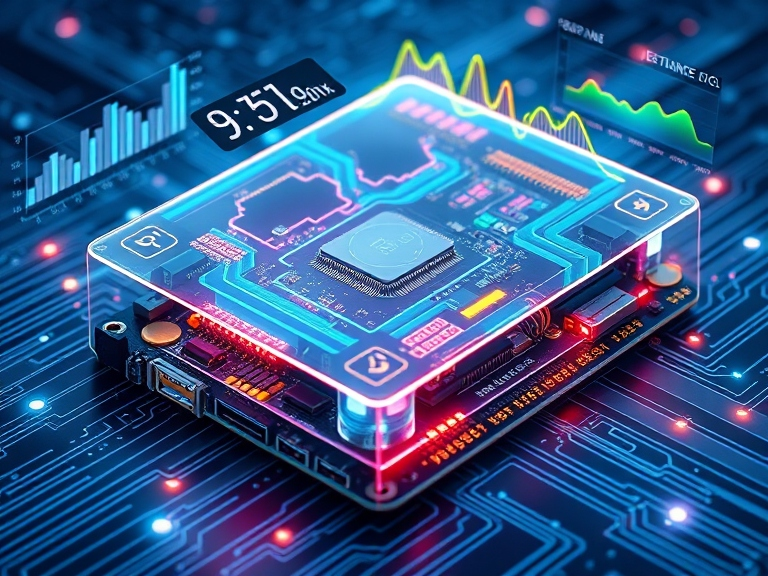

<p align="center">

</p>

<p align="center">
  <a href="https://opensource.org/licenses/Apache-2.0">
    
  </a>
</p>

## 🔗 Quick Links

1. [Introduction](#introduction)
2. [Progress](#-progress)
3. [Getting Started](#-getting-started)
4. [Repository Structure](#-repository-structure)
5. [Contributing](#-contributing)
6. [Acknowledgements](#-acknowledgements)
7. [License](#-license)

## 🔮 Introduction

In this project, we are interested in predicting the characteristics of power consumption and runtime for CNN models on Jetson edge device.

This is particularly helpful in the era of large models to help users design their networks efficiently.

---

### 💡 Approach

The approach we take is similar to that of [NeuralPower paper](https://arxiv.org/abs/1710.05420). We use the same methodology focusing on data collection, model training, and power prediction for TensorRT models on edge devices.

> [!TIP]  
> More information on NeuralPower is documented [here](./docs/NeuralPower.md) and TensorRT is documented [here](./desktop/torch_onnx_trt/docs/TensorRT.md).

## 🎯 Progress

- We have collected power and runtime measurements on a Jetson Orion device for 21 models. The dataset can be found on the DagsHub repository.

- We have trained power and runtime prediction models for 3 different layer types of CNN models. The experiments can be viewed in the DagsHub MLFlow UI.

> [!IMPORTANT]  
> DagsHub repository: <https://dagshub.com/fuzzylabs/edge-vision-power-estimation> </br> </br>
> MLFlow UI: <https://dagshub.com/fuzzylabs/edge-vision-power-estimation.mlflow/>

Learn more about how to get started to train power and runtime prediction models in [Run Locally](#-run-locally) section.

---

## 🛸 Getting Started

### ⚙️ System and Hardware Requirements

- [Jetson Nano Orion Development Kit](https://developer.nvidia.com/embedded/learn/jetson-agx-orin-devkit-user-guide/index.html) - To run benchmarking experiments on Jetson board for collecting power and runtime measurements for a CNN model.

> [!NOTE]  
> If you do not have access to a Jetson device, you can use our training data following the step by step guide outlined in the [getting started](./model_training/README.md#-getting-started) section of `model_training` readme to get started.

For the rest of the project following tools are used,

- [uv](https://docs.astral.sh/uv/) : It is used as default for running this project locally.

- (Optional) [Docker](https://docs.docker.com/get-started/) : `Docker` is as an alternative to `uv`. It is used for running the experiments under [desktop](./desktop/) folders.

---

### 🏎💨 Run Locally

> [!TIP]
> If you don't have access to the Jetson device, our recommendation is to pull training data from DagsHub by following the step by step guide outlined in the [getting started](./model_training/README.md#-getting-started) section of `model_training` readme to train a prediction model.

> [!TIP]
> If you have access to the Jetson device, feel free to follow the step by step guide outlined in the [getting started](./jetson/power_logging/README.md#-getting-started) section of `jetson/power_logging` readme followed by the [getting started](./model_training/README.md#-getting-started) section of `model_training` readme to train a prediction model.

## 📍 Workflow

This project is divided into two stages: [Experimental](#-experimental-stage) and [Implementation](#-implementation-stage)

### 🧪 Experimental Stage

In the experimental stage we experimented with different approaches for benchmarking the conversion of TensorRT models.

> [!TIP]  
> All code and benchmarking scripts for the 3 experimental approaches can be found in the desktop folder: [README](./desktop/README.md)

### 🚀 Implementation Stage

In the implementation stage of the project we created an MLOps pipeline for training the power consumption and runtime prediction models. The pipeline consists of the following two step process:

📊 Jetson Device Benchmarking

1. Collect the power consumption and performance data on the Jetson device
2. Follow the detailed process outlined in [jetson/power_logging](./jetson/power_logging/README.md)

🤖 Machine Learning Model Development

1. Preprocess collected data from the Jetson device
2. Train machine learning models for power and runtime prediction
3. Refer to the comprehensive guide in [model_training](./model_training/README.md)

---

## 📂 Repository Structure

```bash
.
├── assets
├── CONTRIBUTING.md
├── desktop                  # Runtime benchmarking script for desktop
├── docs                      
├── jetson
│   └── power_logging        # Power and runtime measurement benchmarking script for jetson
├── LICENSE
├── model_training           # Power and runtime prediction modelling package
└── README.md
```

- **[desktop](./desktop/README.md)** : This folder contains initial exploration of various approaches to get a TensorRT model from PyTorch model on a desktop/laptop.

- **[jetson/power_logging](./jetson/power_logging/README.md)** : Jetson folder contains scripts to collect power and runtime measurements, `raw_data` for a Convolutional Neural Network (CNN) model on Jetson devices. For this experiment, we used [Jetson Nano Orion Development Kit](https://developer.nvidia.com/embedded/learn/jetson-agx-orin-devkit-user-guide/index.html).

- **[model_training](./model_training/README.md)**: Model training folder uses the `raw_data` collected on the Jetson device to train power and runtime prediction models using sklearn.

## 🔰 Contributing

Contributions are welcome! Please read the [Contributing Guide](./CONTRIBUTING.mds) to get started.

- **💡 [Contributing Guide](./CONTRIBUTING.md)** : Learn about our contribution process and coding standards.
- **🐛 [Report an Issue](https://github.com/fuzzylabs/edge-vision-power-estimation/issues)** : Found a bug? Let us know!
- **💬 [Start a Discussion](https://github.com/fuzzylabs/edge-vision-power-estimation/discussions)** : Have ideas or suggestions? We'd love to hear from you.

## 🙌 Acknowledgements

- [NeuralPower paper](https://arxiv.org/pdf/1710.05420) authors
- [Profiling Energy Consumption of Deep Neural Networks on NVIDIA Jetson Nano](https://publik.tuwien.ac.at/files/publik_293778.pdf) authors
- [readme-ai](https://github.com/eli64s/readme-ai) for Readme inspiration

## 📄 License

Copyright © 2024 [Fuzzy Labs](./README.md). <br />
Released under the [Apache 2.0](./LICENSE)
