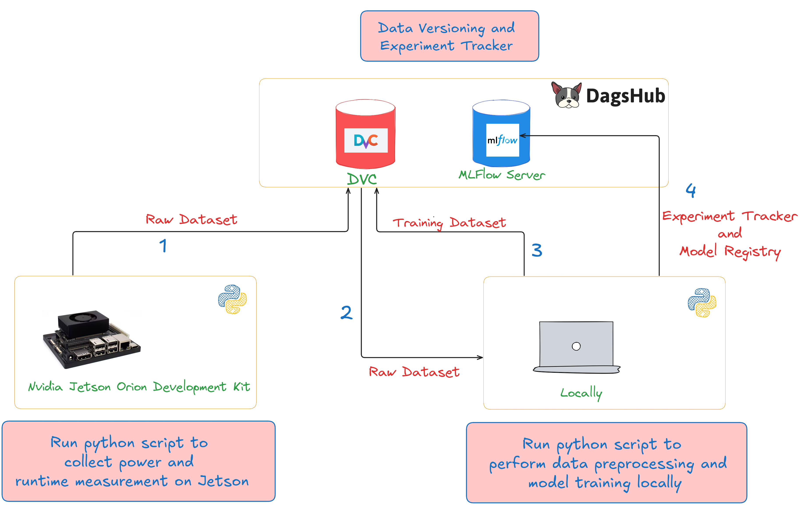

<h1 align="center">
EdgeProfiler
</h1>

<p align="center">

</p>

<p align="center">
  <a href="https://opensource.org/licenses/Apache-2.0">
    
  </a>
</p>

## 🔗 Quick Links

* [Documentation](docs)
* Source Code
  * [Inference](model_training/inference.py)
  * [Training](model_training/run.py)
  * [Data Collection](jetson/power_logging/)
* [Data Hub](https://dagshub.com/fuzzylabs/edge-vision-power-estimation)
* [Experiment Tracking](https://dagshub.com/fuzzylabs/edge-vision-power-estimation.mlflow/)
* [Model Hub](https://dagshub.com/fuzzylabs/edge-vision-power-estimation.mlflow/#/models)

## 🔮 Introduction

**Measure smarter, deploy greener:** A tool for inferring and optimising the power consumption of Convolutional Neural Networks (CNN's) on edge devices.

EdgeProfiler helps you to understand and minimise your model's power consumption and runtime, allowing you to gauge your deployment's environmental impact during the training process to help you to make smarter training decisions. 

---

**What's inside:**
- **Inference:** Determine power consumption and runtime for different layers in a CNN model on an Nvidia Jetson edge device using our custom models.
- **Training:** Build your own power consumption and runtime models using DagsHub for data versioning, Scikit-Learn for model training and MLFlow for experiment tracking.
- **Data Collection:** Record measurements of a model's power consumption and runtime storing all data versions in DagsHub.

<details>
	<summary>❓ How it works</summary>

  The approach we take is similar to that of the <a href="https://arxiv.org/abs/1710.05420">NeuralPower paper</a>. We use the same methodology focusing on data collection, model training, and power prediction for TensorRT models on edge devices.

  > **Tip:** More information on NeuralPower is documented [here](./docs/NeuralPower.md) and TensorRT is documented [here](./desktop/torch_onnx_trt/docs/TensorRT.md).
  
  **What we have done until now:**
  
  - We have collected power and runtime measurements on a Jetson Orin device for 21 models. The dataset can be found on the DagsHub repository.

  - We have trained power and runtime prediction models for 3 different layer types of CNN models. The experiments can be viewed in the DagsHub MLFlow UI.
  
  **High-level workflow:**

  1. Collect power and runtime measurements from a Jetson Orin using the [`measure_idling_power.py`](jetson/power_logging/measure_idling_power.py) and [`measure_inference_power.py`](jetson/power_logging/measure_inference_power.py) scripts and then upload to DagsHub with the [`data_version.py`](model_training/data_version.py) script.
  2. Pull the raw dataset from DagsHub onto your development machine using the [`data_version.py`](model_training/data_version.py) script.
  3. Run the data pipeline to create the training dataset using the [`create_dataset.sh`](model_training/create_dataset.sh) script.
  4. Run the [`run.py`](model_training/run.py) model training script storing logs and models with MLFlow. 

  

  > 📌 **Important**
  > 
  > DagsHub repository: <https://dagshub.com/fuzzylabs/edge-vision-power-estimation> </br> </br>
  > MLFlow UI: <https://dagshub.com/fuzzylabs/edge-vision-power-estimation.mlflow/>

  Learn more about how to get started to train power and runtime prediction models in the [Model Training](#-model-training) section.
</details>


## 💪 Getting Started

To get started, set up your python environment. We really like using `uv` for package and project management - so if you don't have it go ahead and follow their installation guide from [here](https://docs.astral.sh/uv/getting-started/installation/).

Once you have it installed move into the `model_training` directory:

```commandline
cd model_training
```

Then run the following to activate the environment and sync dependencies with the environment:

```bash
uv venv --python 3.12
source .venv/bin/activate
uv sync
```

> [!NOTE] 
> The commands to perform inference and training require communicating with the FuzzyLabs DagsHub repository to pull data and models. To be able to do this you will be prompted to create an account or log in if your computer is not authenticated.

## 🧠 Power and Runtime Inference

Performing inference can be done with a single command - if you are not already in the `model_training` directory then move into it:

```commandline
cd model_training
```

Then run the following inference script to predict the power consumption and runtime for  a `resnet18` model on a Jetson Orin device using our custom model:

```commandline
python inference.py \
    --trt-engine-path sample_data/resnet18_trt_engine_info.json \
    --result-csv-path results/resnet18_predictions.csv
```

The [`sample_data`](model_training/sample_data) directory contains a handful of TRT Engine files for you to try. These files contain the features used to generate predictions for different CNN models.

The FuzzyLabs [DagsHub](https://dagshub.com/fuzzylabs/edge-vision-power-estimation/src/main/preprocessed_data) contains `trt_engine_info.json` files for 21 popular CNN models. You can run inference over these files yourself by downloading and passing the path to the same inference script above with the `--trt-engine-path` flag.

### 🫵 Inference on Your Custom CNN

Coming soon...

> **Tip:** For more details on running inference see the  [Inference](./model_training/README.md#-inference) section of the [`model_training`](model_training/README.md) README.

## 🏋️ Model Training

You can reproduce our power consumption and runtime models with a few simple steps. First you need to pull our training data from DagsHub and then run the training script.

If you are not already in the `model_training` directory then move into it:

```commandline
cd model_training
```

Then run the following command to retrieve the training dataset from DagsHub:

```commandline
python data_version.py \
    --owner fuzzylabs \
    --name edge-vision-power-estimation \
    --local-dir-path training_data \
    --remote-dir-path training_data \
    --branch main \
    --download
```

Once you have access to the training dataset you can train your own model with our training script:

```commandline
python run.py
```

> **Tip:** For more details on training your own model see the  [Run Training Script](./model_training/README.md#-run-training-script) section of the [`model_training`](model_training/README.md) README.

## 🎣 Data Collection

In the [Model Training](#-model-training) section above we showed you how you can train your own model with our training dataset. 

However, if you do have access to the Jetson device, feel free to follow the step by step guide outlined in the [getting started](./jetson/power_logging/README.md#-getting-started) section of the [`jetson/power_logging`](jetson/power_logging/README.md) README to collect your own measurements.

## 🛣️ Roadmap

For more details on the background of the project please refer to the project's Notion site:

- [Background](https://www.notion.so/fuzzylabs/Energy-efficiency-for-computer-vision-on-the-edge-138b6e71390f80c89e1bd69d02e13192?pvs=4)

## 🔰 Contributing

Contributions are welcome! Please read the [Contributing Guide](./CONTRIBUTING.mds) to get started.

- **💡 [Contributing Guide](./CONTRIBUTING.md)** : Learn about our contribution process and coding standards.
- **🐛 [Report an Issue](https://github.com/fuzzylabs/edge-vision-power-estimation/issues)** : Found a bug? Let us know!
- **💬 [Start a Discussion](https://github.com/fuzzylabs/edge-vision-power-estimation/discussions)** : Have ideas or suggestions? We'd love to hear from you.

## 🙌 Acknowledgements

The following resources have served as an inspiration for this project:

- [NeuralPower paper](https://arxiv.org/pdf/1710.05420) authors
- [Profiling Energy Consumption of Deep Neural Networks on NVIDIA Jetson Nano](https://publik.tuwien.ac.at/files/publik_293778.pdf) authors

## 📄 License

Copyright © 2024 [Fuzzy Labs](./README.md). <br />
Released under the [Apache 2.0](./LICENSE)
