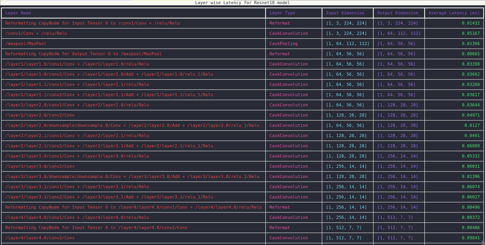
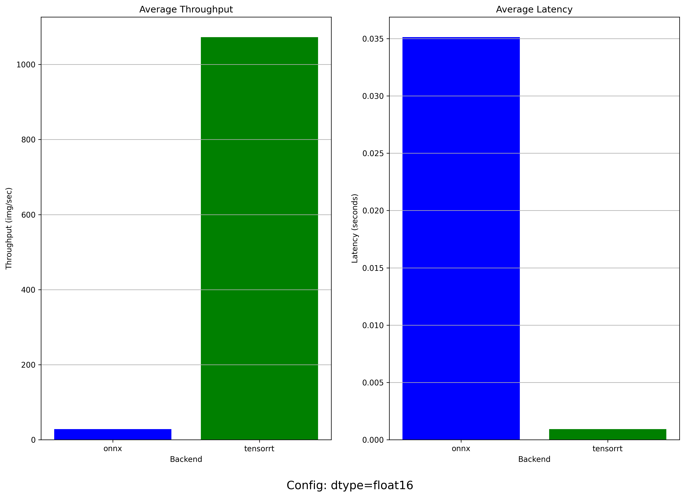

# PyTorch-ONNX-TensorRT

We take a two-step approach for this experiment,

1. Convert PyTorch model to ONNX format using `torch.onnx` function
2. Create a TensorRT inference using the ONNX model by creating a wrapper around TensorRT Python API.

A major difference between [Torch-TensorRT](../torch_trt/README.md) experiment and current approach is we have full control over creating TensorRT engine and inference using engine.

Tested this on machine with following configuration

```txt
Python - 3.11
uv - 0.4.25
GPU - Nvidia GeForce RTX 3060 Mobile
OS - Ubuntu 22.04.5 LTS
```

An introduction documentation to TensorRT : [Readme](./docs/TensorRT.md).

## Getting Started

There are two approaches to run this project.

### Locally

```bash
uv venv --python 3.11
source .venv/bin/activate
uv pip install -r pyproject.toml
```

### Docker

Build and run docker image using [Dockerfile](./Dockerfile)

> Note: Size of Docker image `nvcr.io/nvidia/pytorch:24.09-py3` is around 9 GB.

```bash
docker build -t benchmark_torch_onnx_trt .
docker run --gpus all -it -v $(pwd):/app benchmark_torch_onnx_trt
```

> Note: Replace `uv run` in following commands with `python` if running the script inside docker container.

### Run the benchmark script

For example let us run the benchmark script using Mobilenetv2 model from [pytorch hub](https://pytorch.org/hub/pytorch_vision_mobilenet_v2/)

```bash
uv run benchmark.py --model mobilenet_v2 --backend onnx --save-result
# Build tensorrt engine
uv run trt/build_engine.py --onnx models/mobilnet_v2/mobilnet_v2_fp16.onnx
# Use tensorrt backend
uv run benchmark.py --model mobilenet_v2 --backend tensorrt --save-result
```

> Note: We first have to build a TensorRT engine using [build_engine.py](./trt/build_engine.py) script and the run benchmark using the TensorRT engine.

### Visualize TensorRT profiler

```bash
# By default alexnet model is used
uv run viz_profiler.py

# Mobilenetv2 model 
uv run viz_profiler.py --profiler-dir results/mobilenet_v2/trt_profiling

# Resnet18 model 
uv run viz_profiler.py --profiler-dir results/resnet18/trt_profiling
```

An example output is shown below. The table shows following information for TensorRT model

* Layer Name
* Input Dimension
* Output Dimension
* Average Latency for layer (milliseconds)



There are boxplots for various model under the `results/model_name` directory. The boxplot plots layer-wise latency for each layer of the TensorRT model. An example of `resnet18` model shown below.


### Visualize latency and throughput across backends

```bash
# By default alexnet model is used
uv run viz.py

# Mobilenetv2 model 
uv run viz.py --model-dir results/mobilenet_v2

# Resnet18 model 
uv run viz.py --model-dir results/resnet18
```

The comparison plots for each model are saved under the `results/model_name` directory. An example of `mobilenetv2` model shown below.



## Notes and Limitations

* We are limited by the support of [ONNX Operators](https://github.com/onnx/onnx-tensorrt/blob/main/docs/operators.md) using this approach.

* ONNX Runtime also supports [TensorRT](https://onnxruntime.ai/docs/execution-providers/TensorRT-ExecutionProvider.html) as it's execution provider. We don't have to write a TensorRT Python API inference runtime and engine builder ourselves. ONNX runtime would take care of it for us. This approach is not tested.
