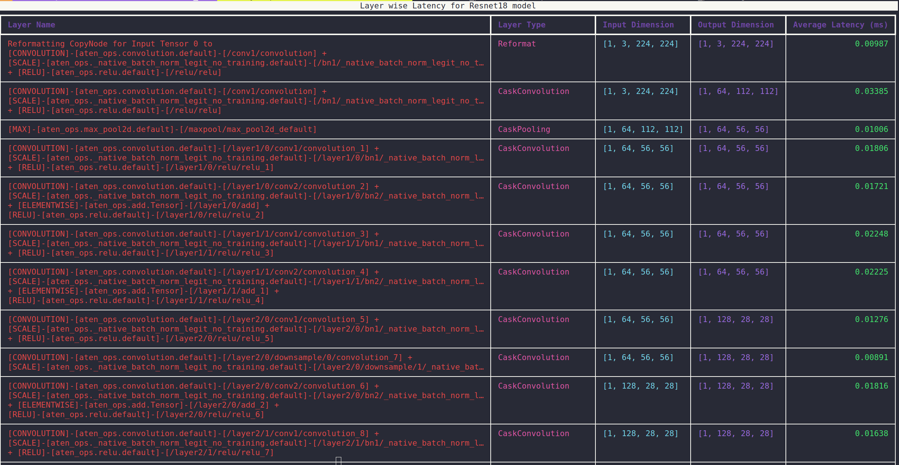
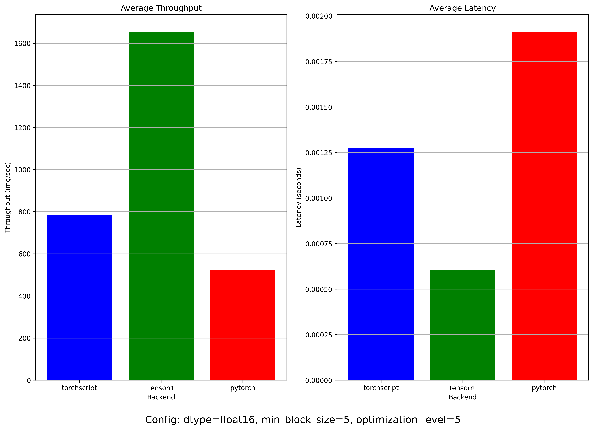

# Torch-TensorRT

There are 3 backends supported by benchmark script

* PyTorch
* TorchScript
* TensorRT

The latency and throughput for all the backends are stored in json file under `model_name` folder.

For `tensorrt` backend we also store the profiling traces under the `model_name/trt_profiling` folder. There are two JSON files saved as part of this backend:

1. `trt_layer_latency.json`: This file contains layer-wise latency for each run. An example for alexnet model [here](./results/alexnet/trt_profiling/trt_layer_latency.json).
2. `trt_engine_info.json`: This file contains detailed information for each layer in the TensorRT model including the number of weights, biases, filter, stride, and padding. An example for alexnet model [here](./results/alexnet/trt_profiling/trt_engine_info.json).

Tested this on machine with following configuration

```txt
Python - 3.11
uv - 0.4.25
GPU - Nvidia GeForce RTX 3060 Mobile
OS - Ubuntu 22.04.5 LTS
```

An introduction documentation to Torch-TensorRT : [Readme](./docs/TorchTensorRT.md).

## Getting Started

There are two approaches to run this project.

### Locally

> Note: Building and install `torch-tensort` package takes about 15 mins.

```bash
uv venv --python 3.11
source .venv/bin/activate
uv pip install -r pyproject.toml
```

### Docker

Build and run docker image using [Dockerfile](./Dockerfile)

> Note: Size of Docker image `nvcr.io/nvidia/pytorch:24.09-py3` is around 9 GB.

```bash
docker build -t benchmark_torch_trt .
docker run --gpus all -it -v $(pwd):/app benchmark_torch_trt
```

> Note: Replace `uv run` in following commands with `python` if running the script inside docker container.

### Run the benchmark script

For example let us run the benchmark script using Mobilenetv2 model from [pytorch hub](https://pytorch.org/hub/pytorch_vision_mobilenet_v2/)

```bash
uv run benchmark.py --model mobilenet_v2 --backend pytorch --save-result
uv run benchmark.py --model mobilenet_v2 --backend torchscript --save-result
uv run benchmark.py --model mobilenet_v2 --backend tensorrt --save-result
```

### Visualize TensorRT profiler

```bash
# By default alexnet model is used
uv run viz_profiler.py

# Mobilenetv2 model 
uv run viz_profiler.py --profiler-dir results/mobilenet_v2/trt_profiling

# Resnet18 model 
uv run viz_profiler.py --profiler-dir results/resnet18/trt_profiling
```

An example output is shown below. The table shows following information for TensorRT model

* Layer Name
* Input Dimension
* Output Dimension
* Average Latency for layer (in milliseconds)



There are boxplots for various model under the `results/model_name` directory. The boxplot plots layer-wise latency for each layer of the TensorRT model. An example of `resnet18` model shown below.


### Visualize latency and throughput across backends

```bash
# By default alexnet model is used
uv run viz.py

# Mobilenetv2 model 
uv run viz.py --model-dir results/mobilenet_v2

# Resnet18 model 
uv run viz.py --model-dir results/resnet18
```

The comparison plots for each model are saved under the `results/model_name` directory. An example of `resnet18` model shown below.


