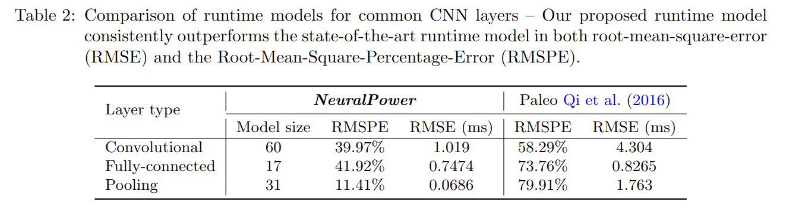
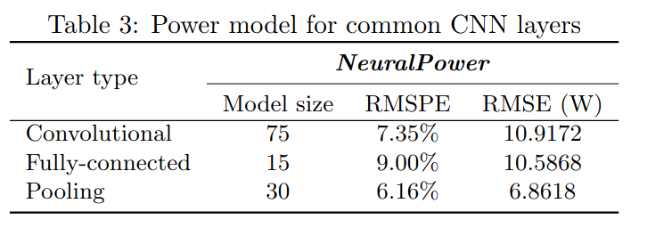
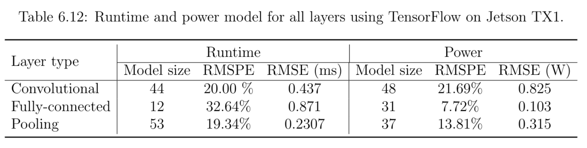

# Neural Power
TL;DR: The NeuralPower paper introduces a process to predict power and runtime consumption of CNN-based models. Their methodology used Caffe models. We use the same process as the paper but for TensorRT models. TensorRT models are optimized model inferencing engine for Nvidia GPUs and Jetson devices.
Paper: <https://arxiv.org/abs/1710.05420>

## 🔗 Quick Links

1. [Overview](#overview)
2. [Methodology](#methodology)
3. [Results](#results)
4. [Extra](#extra)

The [NeuralPower](<https://arxiv.org/abs/1710.05420>) paper starts with the following 3 questions the motivation for their research,

1. How much energy is consumed for an inference made by a convolutional neural network (CNN)?
2. Is it possible to predict this energy consumption before a model is even trained?
3. If yes, how should machine learners select an energy-efficient CNN for deployment?

In our project we are interested in understanding whether these questions can be answered for CNN inference on edge devices.

## Overview

In the NeuralPower study, the authors train a polynomial regression model and a linear regression model to predict power consumption and inference runtime respectively. The power consumption model achieved an average accuracy of 88.34% while the runtime model yielded an improvement of 68.5% compared to previous state-of-the-art models.

## Methodology

Before looking into how to train a regression model that predicts power consumption and runtime for a CNN model, we look at how data is collected to enable the training process.

### Data Collection

The authors used a collection of Caffe CNN models for their experiment.

> [!NOTE]
> We use [PyTorch Hub](https://pytorch.org/hub/) to retrieve pre-trained CNN models for our project.

For each model, power consumed and runtime taken for each layer in the model is recorded.

To measure runtime for each layer, the authors used the Paleo framework, based on research by [Qi et al](https://openreview.net/pdf?id=SyVVJ85lg).

> [!NOTE]
> We create a custom TensorRT profiler using [IProfiler](https://docs.nvidia.com/deeplearning/tensorrt/api/python_api/infer/Core/Profiler.html#tensorrt.IProfiler) TensorRT Python API to measure the runtime for each layer in the TensorRT model on the Jetson device.

Since the experiment is performed on a Nvidia GeForce Titan X GPU, the authors used `nvidia-smi` to collect power measurements for model training on a 1 ms interval.

> [!NOTE]
> Our process for measuring power consumption on the Jetson device is detailed in [Power Consumption and Benchmarking documentation](../jetson/power_logging/docs/Power_consumption.md) document.

The dataset consists of layer-level runtime and power consumption for all of the CNN models. The authors focused on data related to 3 types of layers:

* Convolutional
* Pooling
* Dense

A power consumption and runtime model is trained for these 3 layers, leading to a total of 6 models.

---

### Training Model

Once the dataset is collected for all the models of interest, a polynomial regression model is trained. The authors outline 3 reasons for this choice:

(i) First, in terms of model accuracy, polynomial models provide more flexibility and low prediction error when modeling both power and runtime.

(ii) The second reason is the interpretability: runtime and power have clear physical correlation with the layer’s configuration parameters

(iii) The third reason is the available amount of sampling data points. Polynomial models allow for adjustable model complexity by tuning the degree of the polynomial, ranging from linear model to polynomials of high degree, whereas a formulation with larger model capacity may be prone to overfitting.

#### Layer-level Power Modelling

A polynomial regression learns the coefficients using the input data. For power modelling, various features for a layer are combined to create an n-th degree polynomial term. 

For example, for the following feature for dense layers:

* Batch Size
* Input Tensor Size
* Output Tensor Size

then a 2-degree polynomial would consider pair-wise combinations of each feature as it's training data.

For a convolution layer, the features consist of the following:

* Batch Size
* Input Tensor Size
* Kernel Size
* Stride Size
* Padding Size
* Output Tensor Size

For the pooling layer, the features include:
* Input Tensor Size
* Stride Size
* Kernel Size
* Output Tensor Size

A power model is trained for each of the layer type using Lasso and cross-validation to find a polynomial degree that maximises the accuracy using the selected features.

#### Layer-level Runtime Modelling

In addition to the features included in the power modelling, runtime modelling adds special features to the regression model. The special features include the total number of memory accesses and the total number of
floating point operations for each layer.

The same methodology of using  Lasso and cross-validation is used to find optimal polynomial degree.

## Results

The figure below shows the performance of the NeuralPower runtime model.

The figure below shows the performance of the NeuralPower power model.

RMSPE in the figure refers to Root Mean Square Percentage Error and RMSE is Root Mean Squared Error.

## Extra

The primary author of the paper has also tested the NeuralPower approach on a Nvidia Jetson TX1 edge device. This research is published in [Power/Performance Modeling and Optimization: Using and Characterizing Machine Learning Applications](https://kilthub.cmu.edu/articles/Power_Performance_Modeling_and_Optimization_Using_and_Characterizing_Machine_Learning_Applications/7212224), Section 6.3.

