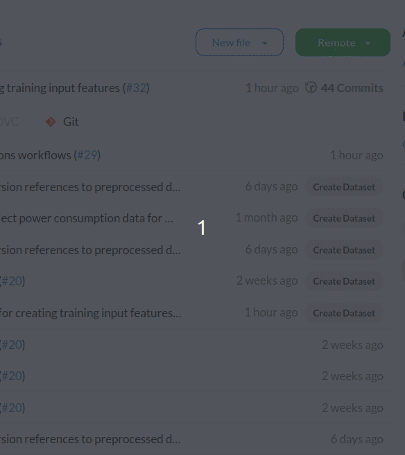
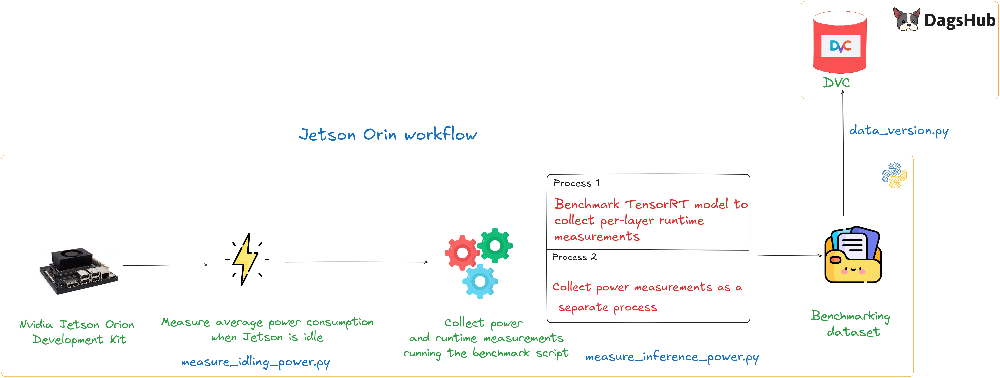

# Jetson

Measure power consumption and runtime for CNN models on the jetson device.

## 🔗 Quick Links

1. [Getting Started](#-getting-started)
2. [Approach](#-approach)
3. [Repository Structure](#-repository-structure)
4. [Documentation](#-documentation)

## 🛸 Getting Started

### ⚙️ Requirements

[Jetson Nano Orion Development Kit](https://developer.nvidia.com/embedded/learn/jetson-agx-orin-devkit-user-guide/index.html) - To run benchmarking experiments on a Jetson device for collecting power and runtime measurements for a CNN model.

Following is the configuration of software and tools on the Jetson device used for testing:

```txt
JetPack 6.1
Jetson Linux 36.4
Docker 27.3.1
OS - Ubuntu 22.04-based root file system
```

[DagsHub account](https://dagshub.com/) and a repository for data versioning.

---

### 🏎💨 Run Experiment Script

1. To maximise the Jetson power and fan speed run the following command on Jetson.

    ```bash
    sudo nvpmodel -m 0
    sudo jetson_clocks
    ```

2. Build the docker image

    ```bash
    sudo docker build -t edge-vision-benchmark -f Dockerfile.jetson .
    ```

> [!IMPORTANT]  
> Use this exact Docker image to ensure compatibility with `tensorrt==10.1.0` and `torch_tensorrt==2.4.0`.</br>
> Base image `nvcr.io/nvidia/pytorch:24.06-py3-igpu` might take some time to download on Jetson. (approx. 5 GB in size)

3. Run the container to collect power and runtime measurements for the CNN models

    ```bash
    sudo docker run --runtime=nvidia --ipc=host -v $(pwd):/app -d edge-vision-benchmark
    ```

    This will start running the [`run_experiment.sh`](./run_experiment.sh) script by default. You can also override by passing your custom experiment script.

    More information on the `run_experiment.sh` can be found in the [data collection on Jetson](../../docs/ExperimentScripts.md#data-collection-script-on-jetson) section.

    To follow the logs of the experiment, you can run the following command

    ```bash
    sudo docker logs -f <container-name>
    ```

    You can find the name of the docker container using the `sudo docker ps` command.

4. Add DVC credentials to the Jetson as shown in the video below. Run the commands corresponding to the `Add a DagsHub DVC remote` and `Setup credentials` sections on the Jetson.

    <a href="DVC Remote"></a>

5. Upload benchmark data to DagsHub from Jetson.

    If you are using DVC for **only the first time**, run the following command in the current working directory on the Jetson.

    ```bash
    dvc init
    ```

    Track `raw_data` folder using `dvc add` command

    ```bash
    dvc add raw_data
    ```

    Next, run the following commands to track changes in Git. For example, we create a new branch `raw_data_v1` and add a commit message `Add raw data version 1`. Please make sure to add a new branch and a good commit message for clarity.

    ```bash
    git checkout -b raw_data_v1
    git add raw_data.dvc .gitignore
    git commit -m "Add raw data version 1"
    ```

    Push both the data and new git branch to the remote

    ```bash
    dvc push -r origin
    git push origin raw_data_v1
    ```

> [!NOTE]  
> Learn more about the format of dataset collected in the [raw dataset](../../docs/DatasetFormats.md#raw-dataset-format) section.

## 💡 Approach

The following process outlines the approach taken to collect the power and runtime values for each layer.

First, we measure the idle power value of the Jetson. This power value measures how much power is consumed when minimal required processes are running on the Jetson.

> [!CAUTION]
> The recommendation is to disable any GUI operations and use command line interface on Jetson  to reduce the number of background processes for getting the idle power.

Next, we run two separate process on Jetson wherein the first process runs the benchmarking for a CNN model. This process captures the per-layer runtime for the model. It converts a PyTorch model to a TensorRT model using [TorchTensorRT](https://github.com/pytorch/TensorRT/) library.

In the second process, we launch the power logging script. Two separate processes are used to ensure that the benchmarking and power logging tasks are performed concurrently without interference. This approach prevents the benchmarking process from being slowed down by the additional overhead of logging power measurements.

Finally, we upload the collection of power and runtime data for each model to DagsHub. This is the raw data that we will further preprocess to create training data. This dataset is versioned using DVC.

See the diagram below for a visual explanation:



For more insights into how power is collected on Jetson, refer to the [Power Consumption and Benchmarking on Jetson](../../docs/JetsonPowerMeasurement.md) and the [Behind the Scenes](../../docs/DeepDive.md#power-measurement-and-logging) documentation.

For insights into how runtime is measured for each layer on Jetson, refer to [this](../../docs/DeepDive.md#tensorrt-runtime-profiling) document.

## 📂 Repository Structure

```bash
.
├── assets
├── Dockerfile.jetson
├── docs
├── measure_idling_power.py
├── measure_inference_power.py
├── measure_power.py
├── model                       # Benchmarking utility functions
├── pyproject.toml
├── README.md
├── run_experiment.sh
└── uv.lock
```

- **[measure_idling_power.py](./measure_idling_power.py)** : This script measures average power usage when there Jetson is idle i.e. no benchmarking is being run.

- **[measure_power.py](./measure_power.py)** : This scripts provides a function to read power values from  INA3221 power monitor sensor on Jetson device.

- **[run_experiment.sh](./run_experiment.sh)** : Experiment script that runs the power and runtime collection process end-to-end.

## 📚 Documentation

Here are few links to the relevant documentation for further readings.

- [Raw dataset format](../../docs/DatasetFormats.md#raw-dataset-format)
- [Experiment script](../../docs/ExperimentScripts.md#data-collection-script-on-jetson)
- [Power measurement on Jetson](../../docs/JetsonPowerMeasurement.md)
- [Power logging on Jetson](../../docs/DeepDive.md#power-measurement-and-logging)
- [Runtime profiling on Jetson](../../docs/DeepDive.md#tensorrt-runtime-profiling)
- [TorchTensorRT](../../docs/TorchTensorRT.md)
