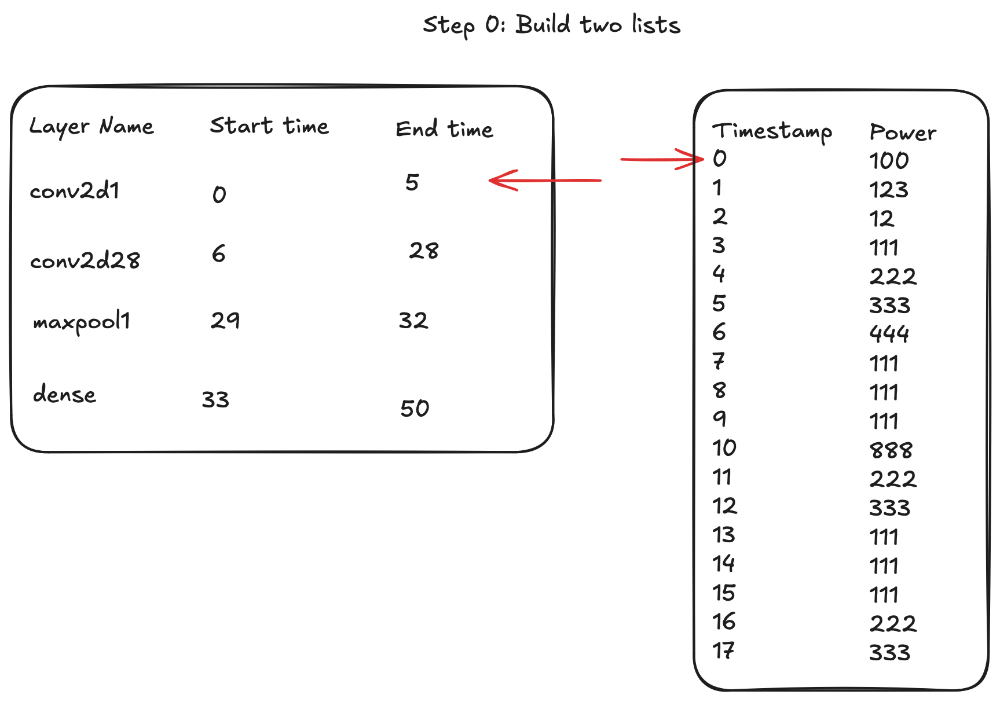
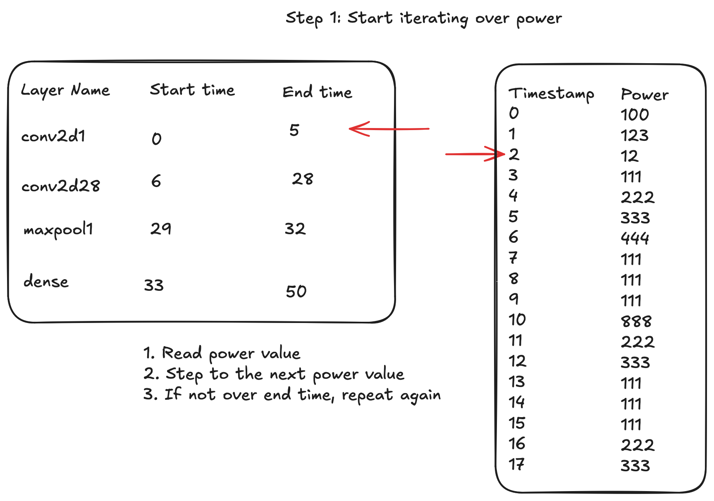
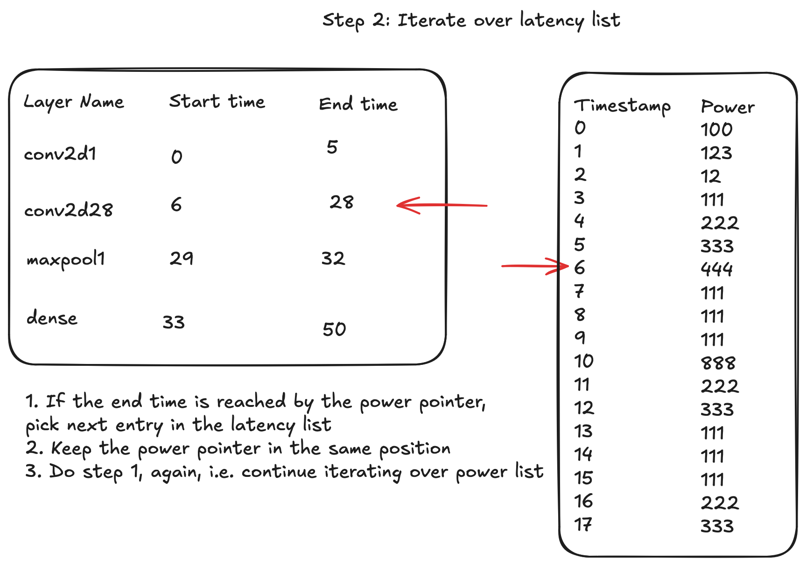

# Measuring Power

To measure power consumption during an inference cycle, two processes are used similar to the profiling energy paper:

1. **Power Logging Process**: Captures power data.
2. **Inference Process**: Runs inference to measure power used by each layer.

The goal is to produce power consumption by layer which will be used as the training data.

The power measurement and inference process have been tested on the Jetson Orion Nano Development Kit with the following configuration:

```txt
JetPack 6.1
Jetson Linux 36.4
Docker 27.3.1
OS - Ubuntu 22.04-based root file system
```

Check [Running the Power Measurement](#running-the-power-measurement) section for the Docker image used for running the experiment. The **EXACT** image must be used.

## Approach

We will implement two processes:

1. A power logging process that continuously records power consumption with timestamps.

2. An inference process that timestamps and logs execution times for each layer.

By aligning these timestamps, we can map power usage to each layer's execution time, enabling precise measurement of power consumed per layer. To refine accuracy, we will repeat this process n times, calculating the average power consumption per layer. This approach is inspired by the profiling paper.

## Getting Started

### Maximise Jetson Orin Performance and Set Fan Speed

Run the following command to maximise performance and set the fan speed:

```bash
sudo /usr/bin/jetson_clocks --fan
```

### Running the Power Measurement

To use our power measurement script, run it inside this Docker image `nvcr.io/nvidia/pytorch:24.06-py3-igpu` (approx. 5 GB in size).
> **Important**: Use this exact Docker image to ensure compatibility with tensorrt==10.1.0 and torch_tensorrt==2.4.0.

Start the container with:

```bash
sudo docker run --runtime=nvidia --ipc=host -it -v $(pwd):/home/innovation-power-estimation-models nvcr.io/nvidia/pytorch:24.06-py3-igpu
```

> Note: Make sure you are in the project folder when you run the above command.

Since we’ve mounted our project directory to `/home`, switch to that directory before running the script:

```bash
cd /home/innovation-power-estimation-models/jetson/power_logging
```

### Running Power Measurement Scripts

You’ll need to run two scripts for measuring power:

1. **[measure_idling_power.py](measure_idling_power.py)** - Measures the idling power of the Jetson Orin Nano. Ensure the performance settings are applied before running this. This script outputs an `idling_power_log_{timestamp}.log` file with idling power data.

To run the this script:

```bash
python measure_idling_power.py
```

Alternatively, we can specify the idling duration such as 120 seconds:

```bash
python measure_idling_power.py \
    --idle-duration 120
```

2. **[measure_inference_power.py](measure_inference_power.py)** - Measures instantaneous power consumption and timestamps for each inference cycle. You can specify the number of inference cycles with the `--runs` argument, 30000 cycles will run by default.

To run the this script with default settings:

```bash
python measure_inference_power.py
```

Alternatively, we can run the power measuring script with various models, specify the number of inference cycles, or save results to different directories, use the following command:

```bash
python measure_inference_power.py \
    --model <pytorch_hub_model_name> \
    --runs RUNS \
    --result-dir RESULT_DIR
```

This script generates multiple log and trace files. The two primary files of interest are:

1. `{n}_cycles_power_log_{timestamp}.log`: Logs power measurements during inference.
2. `trt_layer_latency.json`: Contains layer execution time with the corresponding timestamp.

By default, all results are saved in the `RESULT_DIR` folder.

### Data Versioning

We use DagsHub and DVC to data version control

There are two operations that we can perform for a data versioning.

1. Upload the local data to be version control into DagsHub
2. Download the version control dataset from DagsHub locally

Upload dataset from `raw_data` folder to DagsHub.

```bash
python data_version.py \
    --owner DAGSHUB_USERNAME \
    --name DAGSHUB_REPONAME \
    --local-dir-path raw_data \
    --commit "Add raw data" \
    --upload
```

Download dataset from `raw_data` folder from DagsHub locally.

```bash
python data_version.py \
    --owner DAGSHUB_USERNAME \
    --name DAGSHUB_REPONAME \
    --local-dir-path raw_data \
    --remote-dir-path raw_data \
    --download
```

### Mapping Power Consumption By Layer

To map the individual layer power output for each cycle and produce a CSV file, you’ll need to have your benchmark data from running the two power measurement scripts above which should be in the results folder. This data includes:

1. {n}_cycles_power_log_{timestamp}.log
2. {n}_seconds_idling_power_log_{timestamp}.log
3. trt_layer_latency.json
4. trt_engine_info.json

Once you have these files ready, you can proceed with the mapping process.

> Note: The resulting CSV file can't be included in the repository due to its size exceeding GitHub's limits.

### Visualisation of how the mapping algorithm works




