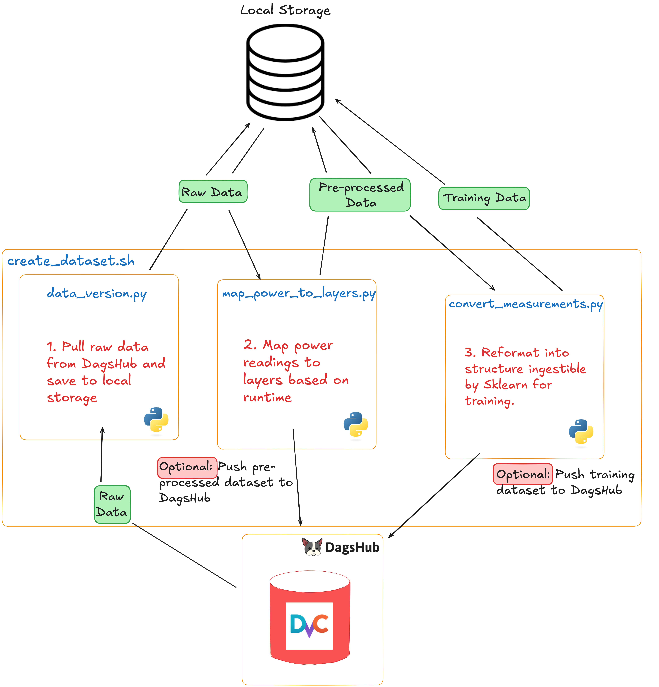

# Model Training

Train power and runtime prediction models.

## 🔗 Quick Links

1. [Approach](#-approach)
2. [Getting Started](#-getting-started)
3. [Repository Structure](#-repository-structure)
4. [Documentation](#-documentation)

## 💡 Approach

We use the raw dataset from Jetson to create a preprocessed and training dataset. The train dataset contains power and runtime measurements for 3 layers, convolutional, pooling and dense for the CNN models.

The raw dataset that we have collected from the Jetson lives in DagsHub - running the [`create_dataset.sh`](create_dataset.sh) script orchestrates the following data pipeline:

1. Pulls the raw dataset to local file storage ([`data_version.py`](data_version.py)).
2. Build the pre-processed dataset by mapping power readings to individual layers in the CNN ([`map_power_to_layers.py`](map_power_to_layers.py)).
3. Reformats the pre-processed dataset into a sklearn compatible training dataset ([`convert_measurements`](convert_measurements.py))



We use [LassoCV](https://scikit-learn.org/stable/modules/generated/sklearn.linear_model.LassoCV.html) model from sklearn to train our prediction models. The sklearn training pipeline contains an input feature preprocessing step for creating the polynomial degree of input features, applying sklearn preprocessing scalers and special terms to input features.

The [`run.py`](run.py) script orchestrates the following training pipeline:

1. Pulls the training dataset from DagsHub.
2. Initiates the training of 3 power consumption and 3 runtime prediction models.
3. Logs metrics and artifacts to MLFlow's experiment tracker.
4. Saves the final model to the MLFlow model server.


## 🛸 Getting Started

### ⚙️ Requirements

[uv](https://docs.astral.sh/uv/) : It is used as default for running this project locally.

Create virtual environment using `uv` and install dependencies required for the project.

```bash
uv venv --python 3.12
source .venv/bin/activate
uv sync
```

You can run the preprocessing and training scripts on your laptop/desktop locally.

---

### 🔋 Inference

Inference script requires path to TensorRT engine information file and a path to save prediction as a CSV file.

Inference script downloads the trained model from MLFlow registry for the inference. There are two sample data for `resnet18` and `vgg16` Tensorrt engine files under [sample_data](./sample_data/) folder.

Following command runs inference for `resnet18` model,

```python
python inference.py \
    --trt-engine-path sample_data/resnet18_trt_engine_info.json \
    --result-csv-path results/resnet18_predictions.csv
```

A prediction CSV is created in the `results` folder. The power prediction is saved under the column `power_prediction` and runtime predictions are saved under the column `runtime_prediction`.

Trained models are downloaded in thee `trained_models` folders. This is how the tree for the `trained_models` folder looks like with all the models downloaded

```bash
trained_models
├── convolutional
│   ├── power
│   └── runtime
├── dense
│   ├── power
│   └── runtime
└── pooling
    ├── power
    └── runtime
```

For each of the layer types (convolutional, dense and pooling), a power and runtime model is downloaded from the MLFlow Registry to your local filesystem.

---

### 🏎💨 Run Training Script

### Raw data is collected on Jetson

If you have uploaded the raw dataset from the benchmarking experiment on the Jetson device, the next step is to get a training dataset.

To process the raw dataset into training data ingestible by a model, run the [`create_dataset.sh`](./create_dataset.sh) script.

```bash
./create_dataset.sh
```

To know more about the contents in this script, refer to the [Data Preprocessing](../docs/ExperimentScripts.md#data-preprocessing-script) script section.

You can also pass the `--push-to-dagshub` flag to the above command, this will enable pushing the `preprocessed_data` and `training_data` to the DagsHub repository.

> [!NOTE]
> If you already have your own `training_data`, then you can skip step 1 and head straight to step 2.

---

### Download Training Data and Run Training

**Download Training Data**: DagsHub already contains the training dataset that we can use directly. To download the latest training dataset run the following command

```bash
python data_version.py \
--owner fuzzylabs \
--name edge-vision-power-estimation \
--local-dir-path training_data \
--remote-dir-path training_data \
--branch main \
--download
```

This will download data from the FuzzyLabs [DagsHub repository](https://dagshub.com/fuzzylabs/edge-vision-power-estimation) to the `training_data` folder on your local filesystem.

> [!NOTE]
> This step is recommended if you want to get started with training the models using data already present on DagsHub repository. </br>
> If you have a new raw dataset, follow step 0 to create a training dataset.

**Run Training Script**: We are all set to train power and runtime prediction models.

```bash
python run.py
```

🎉 That's it. We have successfully trained 6 models for 3 layer types (convolutional, pooling and dense).

To learn more about various configuration offered as part of training script, refer [configuration](../docs/TrainingConfiguration.md) document.

## 📂 Repository Structure

```bash
.
├── assets
├── config                    # Configuration required for training prediction models
├── convert_measurements.py   # Script to convert preprocessed data to training data
├── create_dataset.sh         # Script to convert raw data to train data and upload data to DagsHub 
├── data_preparation          # Utility functions for parsing preprocessed data
├── dataset                   # Dataset Builder
├── data_version.py           # DagsHub client to upload and download data from/to DagsHub
├── map_power_to_layers.py    # Script to convert raw data to preprocessed data
├── model                     # Model Builder
├── notebooks                 # Notebooks containing data exploration and hyperparameter tuning
├── pipeline                  # Trainer
├── pyproject.toml
├── README.md
├── run.py
└── uv.lock
```

- **[run.py](./run.py)**: Entrypoint for training prediction models.

- **[notebooks](./notebooks/)**: Notebooks folder contains jupyter notebooks for exploring data and performing hyperparameter tuning using `optuna` library.

## 📚 Documentation

Here are few links to the relevant documentation for further readings.

- [Training Configuration](../docs/TrainingConfiguration.md)
- [Preprocessed dataset format](../docs/DatasetFormats.md#preprocessing-dataset-format)
- [Training dataset format](../docs/DatasetFormats.md#training-dataset-format)
- [Data preprocessing script](../docs/ExperimentScripts.md#data-preprocessing-script)
- [HyperParameter Tuning](../docs/HyperparameterTuning.md)
- [Mapping power to runtime per-layer](../docs/DeepDive.md#mapping-power-to-layer-runtimes)
