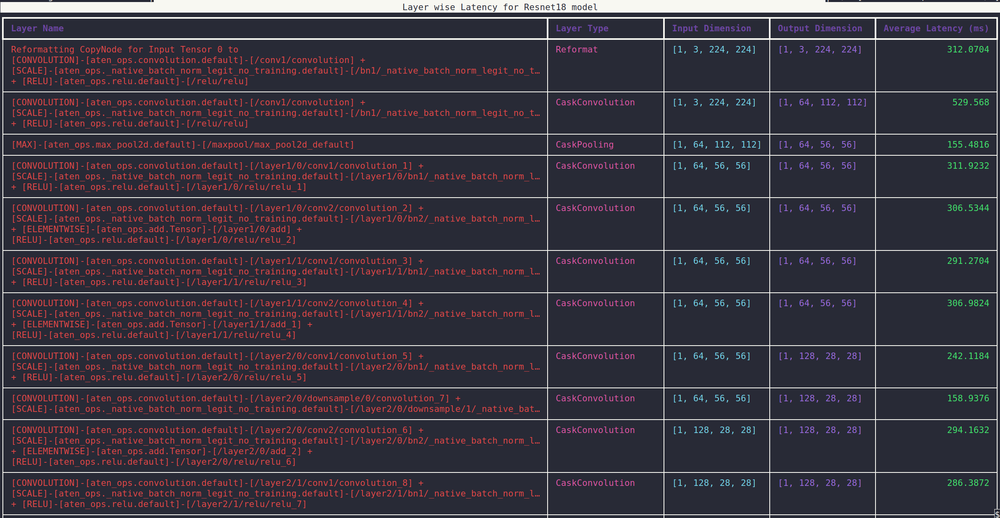
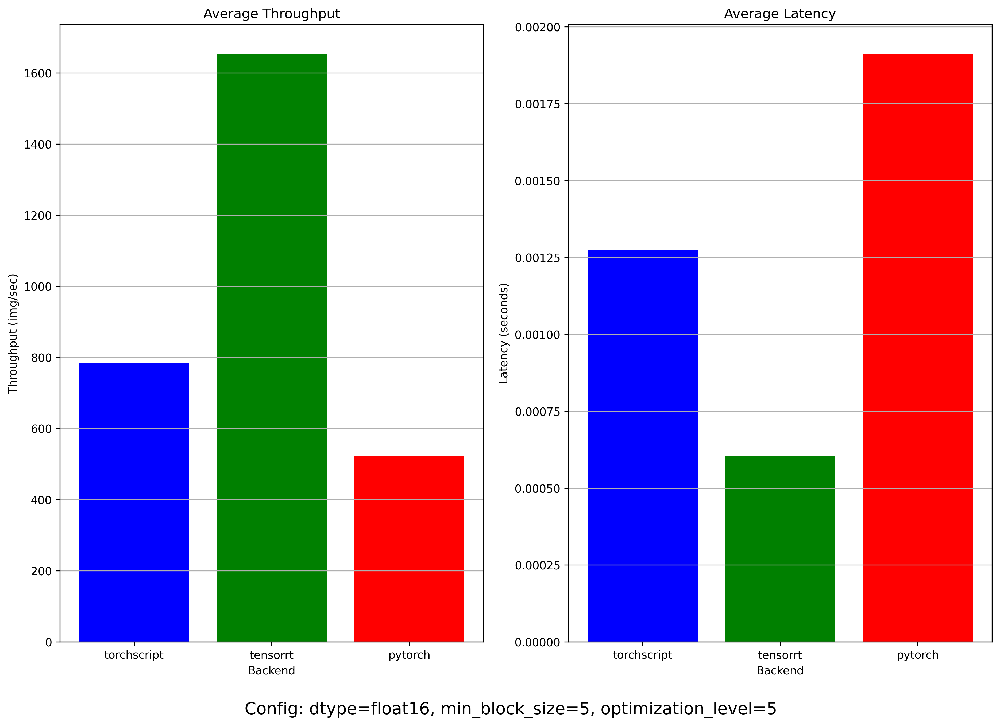

# Torch-TensorRT

There are 3 backends supported by benchmark script

* PyTorch
* TorchScript
* TensorRT

The latency and throughput for all the backends are stored in json file under `model_name` folder.

For `tensorrt` backend we also store the profiling traces under the `model_name/trt_profiling` folder. There are two JSON files saved as part of this backend:

1. `trt_layer_latency.json`: This file contains layer-wise latency for each run. An example for alexnet model [here](./results/alexnet/trt_profiling/trt_layer_latency.json).
2. `trt_engine_info.json`: This file contains detailed information for each layer in the TensorRT model including the number of weights, biases, filter, stride, and padding. An example for alexnet model [here](./results/alexnet/trt_profiling/trt_engine_info.json).

> Note: The profiling trace for layer-wise latency of TensorRT models can be viewed at <https://ui.perfetto.dev/>.

Tested this on machine with following configuration

```txt
Python - 3.11
uv - 0.4.25
GPU - Nvidia GeForce RTX 3060 Mobile
OS - Ubuntu 22.04.5 LTS
```

## Getting Started

There are two approaches to run this project.

### Locally

> Note: Building and install `torch-tensort` package takes about 15 mins.

```bash
uv venv --python 3.11
source .venv/bin/activate
uv pip install -r pyproject.toml
```

### Docker

> Note: Size of Docker image `nvcr.io/nvidia/pytorch:24.09-py3` is around 9 GB.

```bash
docker run --gpus all -it --rm -v $(pwd)/:/workspace/  nvcr.io/nvidia/pytorch:24.09-py3
```

Inside docker container run the benchmark script using following command,

```bash
cd torch_trt
python benchmark.py --model mobilenet_v2 --backend pytorch --save-result
```

> Note: Replace `uv` in following commands with `python` if running the script inside docker container.

### Run the benchmark script

For example let us run the benchmark script using Mobilenetv2 model from [pytorch hub](https://pytorch.org/hub/pytorch_vision_mobilenet_v2/)

```bash
uv run benchmark.py --model mobilenet_v2 --backend pytorch --save-result
uv run benchmark.py --model mobilenet_v2 --backend torchscript --save-result
uv run benchmark.py --model mobilenet_v2 --backend tensorrt --save-result
```

### Visualize TensorRT profiler

```bash
# By default alexnet model is used
uv run viz_profiler.py

# Mobilenetv2 model 
uv run viz_profiler.py --profiler-dir results/mobilenet_v2/trt_profiling

# Resnet18 model 
uv run viz_profiler.py --profiler-dir results/resnet18/trt_profiling
```

An example output is shown below. The table shows following information for TensorRT model

* Layer Name
* Input Dimension
* Output Dimension
* Average Latency for layer (in milliseconds)



There are boxplots for various model under the `results/model_name` directory. The boxplot plots layer-wise latency for each layer of the TensorRT model. An example of `resnet18` model shown below.


### Visualize latency and throughput across backends

```bash
# By default alexnet model is used
uv run viz.py

# Mobilenetv2 model 
uv run viz.py --model-dir results/mobilenet_v2

# Resnet18 model 
uv run viz.py --model-dir results/resnet18
```

The comparison plots for each model are saved nder the `results/model_name` directory. An example of `resnet18` model shown below.



## Notes and Limitations

Exploring and reading [Torch-Tensorrt documentation](https://pytorch.org/TensorRT/), I found that there are 3 approaches to converting a torch model to TensorRT.

* Dynamo Front-end
* TorchScript Front-end
* FX Front-end

It is not particularly clear which approach to prefer for a new user. For this experiment, I used `Dyanmo` approach that uses a FX Graph Module to create a TensorRT module.

Additionally, there are two approaches to create tensorrt module using `Dynamo`

* `torch.compile` [approach](https://pytorch.org/TensorRT/dynamo/torch_compile.html): This approach did not provide a way to get the underlying tensorrt engine.

* [Exported program approach](https://pytorch.org/TensorRT/dynamo/dynamo_export.html) which is what we use as our approach that provides a way to access the converted tensorrt module.

There were few notes/limitations regarding `Torch-Tensorrt` library.

* Dynamo approach does not provide `INT` precision support at the moment.

* `use_python_runtime` parameter to the compiler changes which profiler is being used.
  * If set to `True`, it uses [PythonTorchTensorRTModule](https://github.com/pytorch/TensorRT/blob/d11ff5c14cb45c975b4a9698b211ebacf1a36bb7/py/torch_tensorrt/dynamo/runtime/_PythonTorchTensorRTModule.py#L26C7-L26C32) as it's runtime. This approach _does not_ provide an option in it's [enable_profiling](https://github.com/pytorch/TensorRT/blob/d11ff5c14cb45c975b4a9698b211ebacf1a36bb7/py/torch_tensorrt/dynamo/runtime/_PythonTorchTensorRTModule.py#L417) function to save the layer-wise latency. It instead just prints the traces on the stdout. In our implementation, we have written [utility functions](./trt_utils.py) around this implementation to save layer-wise latency and tensorrt engine information to JSON files.
  * If set to `False`, it uses [TorchTensorRTModule](https://github.com/pytorch/TensorRT/blob/d11ff5c14cb45c975b4a9698b211ebacf1a36bb7/py/torch_tensorrt/dynamo/runtime/_TorchTensorRTModule.py#L53) as it's runtime. This approach _does_ provide [option](https://github.com/pytorch/TensorRT/blob/d11ff5c14cb45c975b4a9698b211ebacf1a36bb7/py/torch_tensorrt/dynamo/runtime/_TorchTensorRTModule.py#L283) to store the profiling traces in a directory.

* At present there's no clean way to profile as noted in one of the issues on the TensorRT repo : <https://github.com/pytorch/TensorRT/issues/1467>. We use a hacky approach to enable profiling as suggested in the comment on the issue.

* There are different modes of [ProfilingVerbosity](https://docs.nvidia.com/deeplearning/tensorrt/developer-guide/index.html#engine-inspector) that shows how detailed information for a particular layer is recorded. Apparently for `dynamo` approach, this is configured implicitly via `debug` parameter [here](https://github.com/pytorch/TensorRT/blob/d11ff5c14cb45c975b4a9698b211ebacf1a36bb7/py/torch_tensorrt/dynamo/conversion/_TRTInterpreter.py#L214).

* There are various parameter like `min_block_size` and `optimization` that affect the TensorRT run times.

* For example, to see if all operators are supported, we set `min_block_size` value to some higher value `100`. This shows how many graph fragmentation occurs and what is recommended value.

    Here's an example output from logs for the `resnet18` model.

    ```bash
    Graph Structure:

    Inputs: List[Tensor: (1, 3, 224, 224)@float16]
        ...
        TRT Engine #1 - Submodule name: _run_on_acc_0
        Engine Inputs: List[Tensor: (1, 3, 224, 224)@float16]
        Number of Operators in Engine: 89
        Engine Outputs: Tensor: (1, 1000)@float16
        ...
    Outputs: List[Tensor: (1, 1000)@float16]

    ------------------------- Aggregate Stats -------------------------

    Average Number of Operators per TRT Engine: 89.0
    Most Operators in a TRT Engine: 89

    ********** Recommendations **********

    - For minimal graph segmentation, select min_block_size=89 which would generate 1 TRT engine(s)
    - The current level of graph segmentation is equivalent to selecting min_block_size=89 which generates 1 TRT engine(s)
    ```

* `optimization-level` parameter decides how long to spend searching for an optimal path to minimize run time for a build. It's value ranges from 0 to 5 (higher levels imply longer build time).
