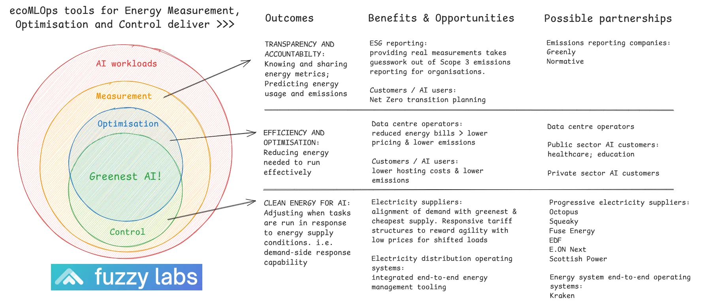

# Introduction

**Our vision** is a world where massive scale up of AI and achievement of climate targets coexist and complement each other.  We see AI optimised for energy efficiency and operating in concert with renewable energy in a high-performance, sustainable global ecosystem.

Current and projected AI adoption rates present an immediate challenge to global resources, and especially energy consumption. For the UK alone, energy for compute could increase CO2 equivalent emissions from under 1 million tonnes in 2024 to over 8 million tonnes in 2030, even allowing for the projected reduction in emissions as expansion of renewable electricity generation continues.  Globally the UK's position is dwarfed by the biggest players.

At [Fuzzy Labs](https://www.fuzzylabs.ai/), we want to tackle this challenge, to allow AI to achieve its potential for good, while protecting the planet. To do this, we’re creating ecoMLOps.

**Our mission** is to create a universally accessible, adopted and evolving set of MLOps tools that actively reduce the climate impact of AI and provide transparency and accountability for AI energy use.  Everything we create is open-source, reducing barriers to adoption and fostering collaboration for collective benefit.

Our tools align to three themes:

The first, **transparency and accountability**, delivers measurement tools that allow developers and organisations using AI to understand energy usage, measure baselines, predict energy use and emissions, set targets and quantify improvements.

The second, **efficiency and optimisation**, delivers tools to reduce the energy demand of AI models., building on community research to provide practical, scalable approaches.

The third, **clean energy for AI,** delivers demand-side management (DSM) tools to control when AI processes take place, dynamically time-shifting to align with when the grid is greenest.

Here's how those tools complement each other to deliver the greenest AI, and examples of the outcomes and opportunities presented.  Working with partners across the value chain to adopt, verify and benefit from the toolset is core to our mission - here we start to identify the kinds of organisations we'd like to work with - please get in touch and let's see what we can achieve!

## What we've done so far

With support through a grant from [Turing Innovation Catalyst](https://ticmanchester.org/), and as part of our [Fuzzy Labs² innovation incubator](https://www.fuzzylabs.ai/squared), we’re underway with a project focussing on energy optimisation for one particular application: computer vision on edge devices. Through this work we’re taking first steps to test out our processes ahead of expanding the scope towards the goal of open source MLOps tools for energy efficiency and optimisation for any AI application, at any scale.

## Existing partners and how to get involved

We are already working with Lancaster University and Turing Innovation Catalyst, and starting discussions with potential commercial partners.

We’d love to hear from you- whether to collaborate on development, explore opportunities for trials, partnerships or just out of interest. Please drop us a line at [talk@fuzzylabs.ai](mailto:talk@fuzzylabs.ai)
